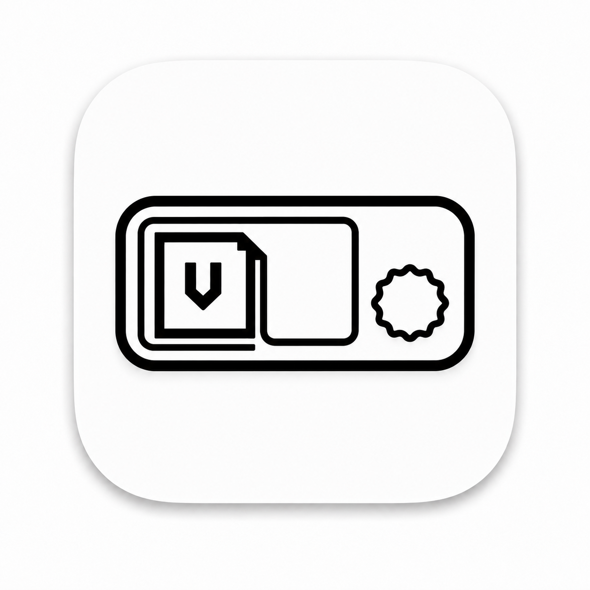
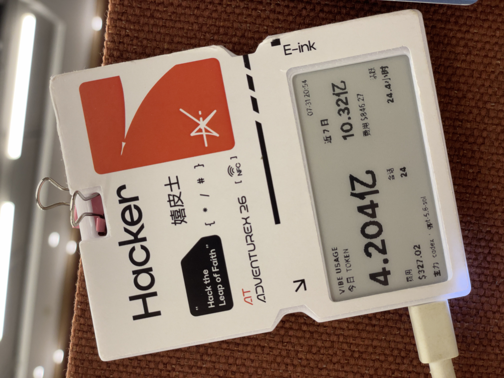
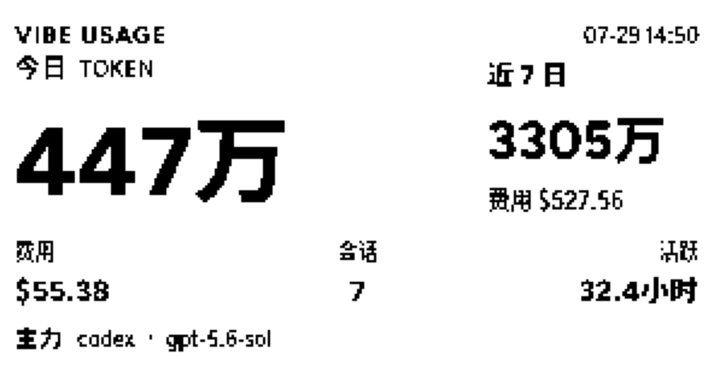
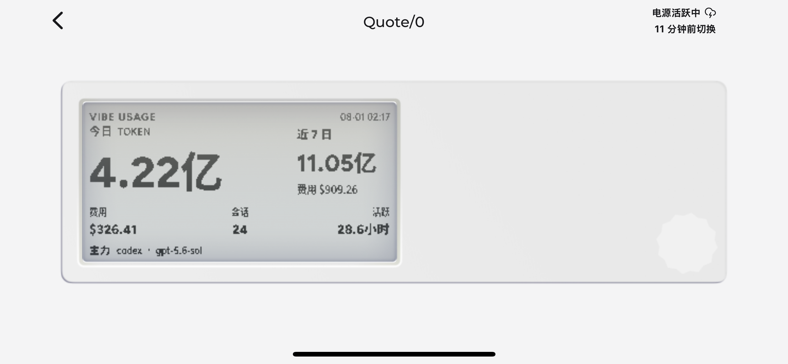
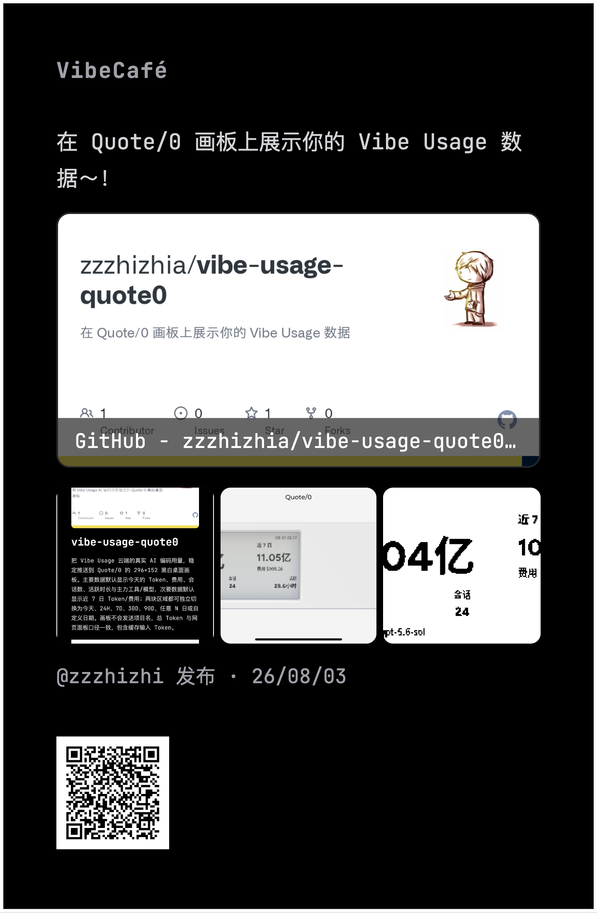
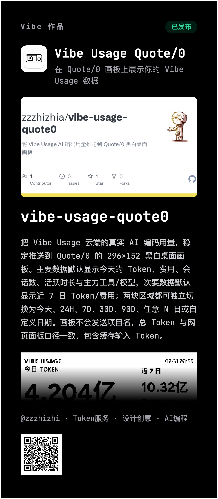

<p align="center">
  
</p>

<h1 align="center">Vibe Usage Quote/0</h1>

把 Vibe Usage 云端的真实 AI 编码用量，稳定推送到 Quote/0 的 296×152 黑白桌面画板。主要数据默认显示今天的 Token、费用、会话数、活跃时长与主力工具/模型，次要数据默认显示近 7 日 Token/费用；两块区域都可独立切换为今天、24H、7D、30D、90D、任意 N 日或自定义日期。画板不会发送项目名，总 Token 与网页面板口径一致，包含缓存输入 Token。

<p align="center">
  <a href="artifacts/readme/quote0-device-photo.jpg">
    
  </a>
</p>

<p align="center"><sub>Vibe Usage 数据在 Quote/0 实体设备上的实际显示</sub></p>

## 实际效果

<p align="center">
  <a href="artifacts/quote0-render-4x.png"></a>
  <a href="artifacts/readme/quote0-app-preview.png"></a>
</p>

<p align="center"><sub>296×152 黑白画板渲染 · Dot. App 中的设备显示效果</sub></p>

### 发布展示

<p align="center">
  <a href="artifacts/readme/vibecafe-release.png"></a>
  <a href="artifacts/readme/vibe-product-page.png"></a>
</p>
<p align="center"><sub>VibeCafe 发布展示 · Vibe 作品详情</sub></p>

## 快速开始

开始前，请在 Dot. App 内容工坊把“画板 API”加入 Quote/0 的设备循环任务，并保持设备在线。

### API Key

- **`QUOTE0_API_KEY`**：在 Dot. App 的“API 密钥”页面创建。
- **`VIBE_USAGE_API_KEY`**：可在 [Vibe Usage 设置页](https://vibecafe.ai/usage/setup)创建。通常无需手动准备：只要本机已安装并登录 Vibe Usage，本项目就会直接读取其本地凭据。

推荐直接运行 `vuq enable`：CLI 会交互式询问是否复用已有凭据；缺失时以不回显方式读取所需 Key 和设备 ID，验证后写入受保护的本地配置。`vuq` 与 `vibe-usage-quote0` 完全等价，可按需使用任一命令。

如需在当前终端中临时覆盖已保存的 Key，可设置环境变量：

```bash
# macOS/Linux
export VIBE_USAGE_API_KEY="<VibeCafe API Key>"
export QUOTE0_API_KEY="<Dot API Key>"
```

```powershell
# Windows PowerShell
$env:VIBE_USAGE_API_KEY = "<VibeCafe API Key>"
$env:QUOTE0_API_KEY = "<Dot API Key>"
```

这些设置仅对当前终端会话生效，可用于 `doctor`、`dry-run` 和 `push`。环境变量只覆盖 Key；设备 ID 和画板仍从本地配置读取。自动刷新任务不会保存或继承 API Key 环境变量，长期配置请使用 `enable`，不要把真实凭据写入 shell 配置、脚本或仓库。

### macOS/Linux

需要 Node.js 20+。Linux 自动刷新还需要可用的 systemd 用户会话。

```bash
npm install -g vibe-usage-quote0
vuq enable
```

### Windows 10/11

需要 Node.js 20+ 和 Windows PowerShell 5.1+。

```powershell
npm install -g vibe-usage-quote0
vuq enable
```

`enable` 会在交互式终端中隐藏读取 `VIBE_USAGE_API_KEY`、`QUOTE0_API_KEY` 和设备 ID，然后自动完成：

1. 验证当前主要/次要显示档位的 Vibe 用量接口及 Dot/Quote 凭据。
2. 发现设备上的 `CANVAS_API`；存在多个画板时要求按脱敏编号选择，不猜测目标。
3. 原子写入受保护的配置，不把凭据放进命令参数、日志或定时任务。
4. 执行一次真实 push，等待最多 90 秒并确认渲染确实发生变化。
5. 安装当前用户的 30 分钟自动刷新：macOS 使用 launchd，Linux 使用 systemd user timer，Windows 使用 Limited 计划任务。

已有配置默认复用；替换时必须再次确认。新凭据验证失败不会覆盖旧配置。设备休眠或调度安装失败时，有效配置会保留，命令会明确说明失败阶段；修复后重新运行同一条 `vuq enable` 即可。

## 常用命令

```bash
vuq doctor
vuq dry-run
vuq push
vuq display main today
vuq display secondary 7d
vuq interval 30
vuq disable
vuq update
```

| 命令 | 作用 |
|---|---|
| `enable` | 安全配置、真实推送并安装当前平台的自动刷新 |
| `doctor` | 读取已配置的两组 Vibe 时间窗口，确认目标画板与设备状态 |
| `dry-run` | 只访问 Vibe，输出聚合数值与 Canvas payload 脱敏摘要 |
| `push` | 立即推送，并等待真实渲染变化 |
| `display <main/secondary> <range>` | 独立配置主要或次要数据的显示档位，下次刷新生效 |
| `interval <minutes>` | 设置 1-44640 分钟的刷新间隔，并更新已安装的调度任务 |
| `disable` | 解除本工具的定时任务，保留配置、日志和渲染图 |
| `update` | 通过 npm 全局更新至最新版 |

`push` 会先精确选择画板，再检查设备状态。休眠、离线、关机或未知状态会在 Canvas POST 前失败。只有 `renderInfo.last`、渲染图 URL 或同一 URL 的图片内容指纹发生变化才算成功；HTTP 2xx 本身不算渲染完成。

## 显示档位

红框对应 `main`：Token 大数字、费用、会话、活跃时长和主力工具/模型都会使用这一时间窗口。绿框对应 `secondary`：Token 和费用使用另一套独立时间窗口。默认值是 `main=today`、`secondary=7d`。

```bash
# 固定档位
vibe-usage-quote0 display main today
vibe-usage-quote0 display main 24h
vibe-usage-quote0 display secondary 7d
vibe-usage-quote0 display secondary 30d
vibe-usage-quote0 display secondary 90d

# 任意 N 日（1-3650）；1d 会规范为 24h
vibe-usage-quote0 display main 14d

# 自定义首尾日期，包含开始日和结束日
vibe-usage-quote0 display secondary 20260701-20260731
```

`today` 是当前系统时区的本地零点到现在，只会随当天用量增长；`24h` 是持续滚动的最近 24 小时，两者语义不同。`7d`、`30d`、`90d` 和其他 `Nd` 使用固定日数查询。日期与档位大小写会被规范化；无效日期、倒序日期或非法参数会在写配置前失败。命令只保存指定区域，另一块区域和所有凭据保持不变；运行 `push` 或等待下一次定时刷新即可更新画板。

## 平台与安全

| 平台 | 自动刷新 | 配置保护 |
|---|---|---|
| macOS | 当前用户 launchd LaunchAgent | 配置文件严格为 `0600` |
| Linux | 当前用户 systemd service + timer，无需 root | 配置文件严格为 `0600` |
| Windows 10/11 | 当前用户、Limited 计划任务 | 关闭 ACL 继承，仅允许当前用户 |

Vibe 配置写入 `~/.vibe-usage/config.json`。Quote 配置在 macOS/Linux 写入 `${XDG_CONFIG_HOME:-~/.config}/vibe-usage-quote0/config.json`，Windows 默认写入 `%APPDATA%\vibe-usage-quote0\config.json`。这些文件由 `enable` 自动创建和保护，无需手工编辑。

macOS/Linux 的渲染图保存到 `${XDG_DATA_HOME:-~/.local/share}/vibe-usage-quote0/quote0-render.png`；Windows 默认保存到 `%LOCALAPPDATA%\vibe-usage-quote0\quote0-render.png`。下载后会检查 296×152 尺寸、黑白像素、墨点覆盖率和画布边缘。没有可下载 URL 时只报告“API 已确认，视觉未确认”。

macOS launchd 和 Linux systemd unit 会保存显式设置的 XDG 路径，但不会保存 API Key 或设备 ID。请使用全局安装；不要用临时 `npx` 路径创建长期自动刷新任务。

## 故障排查

- `enable 需要交互式终端`：直接在 Terminal、shell 或 PowerShell 窗口中运行，不要通过管道、CI 标准输入或命令参数传递凭据。
- 没有 `CANVAS_API`：先在 Dot. App 内容工坊把“画板 API”加入该设备循环任务，再重新运行 `enable`。
- “设备休眠中”或“状态无法确认可用”：唤醒设备，确认持续接电联网后重试；程序不会在不确定状态下推送。
- “90 秒内未变化”：API 可能已接收，但没有证据证明 Quote/0 完成了新渲染。先在 Dot. App 对 `Vibe Usage` 使用“更多 → 立即显示”，再检查固定内容时段、电源和网络。
- macOS 调度失败：确认当前命令运行在图形登录用户会话，并查看 `${XDG_STATE_HOME:-~/.local/state}/vibe-usage-quote0/launchd.stderr.log`。
- Linux 调度失败：确认 `systemctl --user` 可用；容器、精简发行版或没有用户 bus 的会话可在 `enable` 最后选择不安装自动刷新，配置和手动 `push` 仍可使用。
- Windows 调度失败：确认 PowerShell 5.1+ 可用，并从同一当前用户会话重新运行 `enable`。
- `401`：Vibe 或 Dot API Key 无效；客户端不会重试。
- `429`、`5xx` 或网络错误：最多退避重试 3 次，仍失败则非零退出。

## 开发验证

```bash
pnpm build
pnpm test
pnpm security-check
pnpm pack --dry-run
```

项目使用 Node.js ESM、内置 `fetch`/`node:test`，没有运行时依赖。`security-check` 会扫描整个项目根目录，发现疑似真实凭据或白名单外文件时非零退出。
